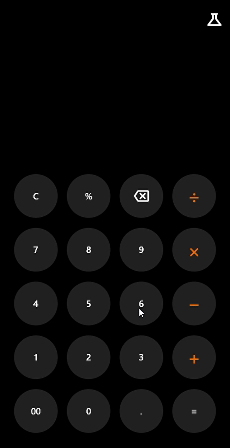

# flutter_calculator

Example project demonstrating how to build a calculator app in Flutter

## Getting Started

To build and run this project:

1. Get Flutter [here](https://flutter.dev) if you don't already have it
2. Clone this repository
3. Navigate to the repository folder
4. Run `flutter run-android` or `flutter run-ios` to build the app

(Please note that a Mac with XCode is required to build for iOS)

## Contributing

Questions, comments, suggestions, and other contributions are welcome, as this is an open-source example project and not officially maintained as part of an application or library etc.

## License

This project is licensed under the MIT License - see the [LICENSE](LICENSE) file for details.
